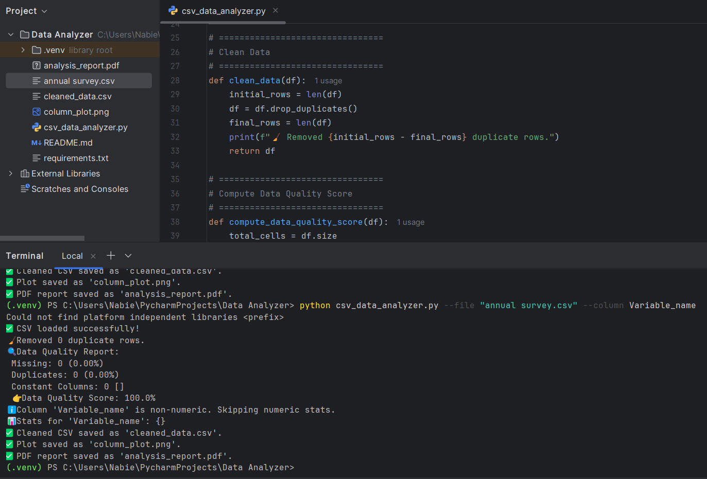

# 📊 CSV Data Analyzer (Pro Version)

A professional CLI tool that:
✅ Loads a CSV  
✅ Cleans data (removes duplicates)  
✅ Computes a unique Data Quality Score  
✅ Analyzes a numeric column  
✅ Saves a cleaned CSV  
✅ Generates a smart plot (bar or hist)  
✅ Creates a PDF report with stats & plot!

## 🚀 How to Run

1️⃣ Install requirements:
```
pip install -r requirements.txt
```

2️⃣ Run with arguments:
```
python csv_data_analyzer.py --file your_file.csv --column YourColumn
```

Outputs:
- `cleaned_data.csv`
- `column_plot.png`
- `analysis_report.pdf`

Perfect for your data quality checks and your portfolio! 🚀✨

